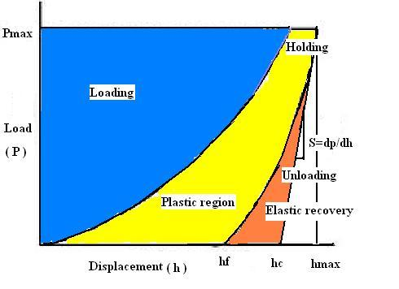
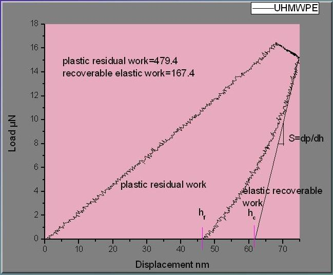
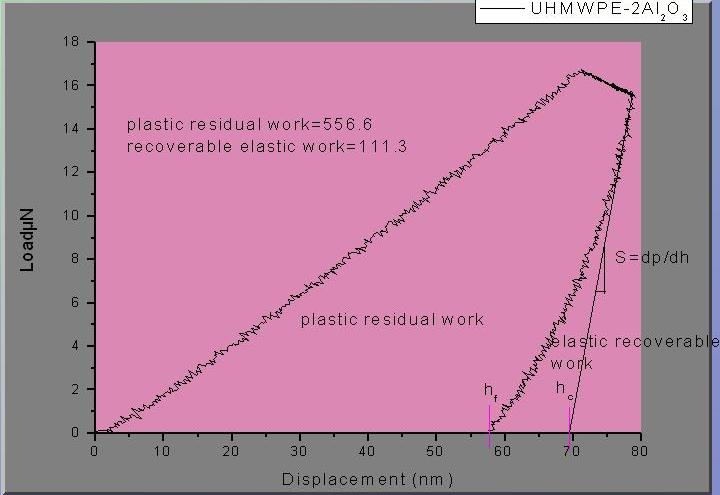
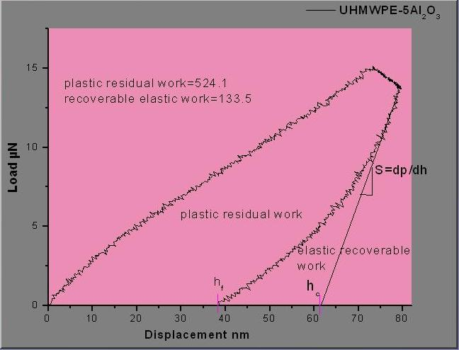
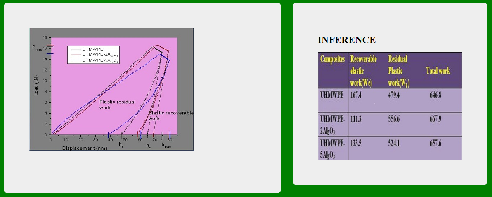

<b>Nanoindentation</b>:-  
Nanoindentation is a standard method to investigate mechanical properties like hardness,elasticity,plasticity index of the material which gives ability to resist permanently,deformed when load is applied.It is mainly concerned with the depth of penetration to nm resolution and the measuring the forces in the uN range in high accuracy and precision. Hardness is proportional to the applied load P divided by the area of contact surface projected in the material. Elastic deformation occurs due to the stretching of the bonds between the atoms when load is applied and when load is removed,it comes back to the original shape.Plastic deformation occurs when load is applied beyond the elastic limit and permanent deformation will takes place. Tensile testing are normally used for bulk samples but nanoindentation can even measure thin film coatings, polymeric materials and soft tissues etc.  

 
<video width="500" height="240" controls>
  <source src="images/nfm.mp4" type="video/mp4">
  Your browser does not support the video tag</video>
 
  

<a href="https://youtu.be/-8HISU35vhY">NPTEL Link</a>  
<b>How to perform Nanoindentation?</b>  
Nanoindentation is a powerful technique where the indenter tip of known geometry is projected into the specific site in the material to be tested, increasing load is applied and when it reaches the designated maximum value, partial unloading is performed until desired depth is attained. The holding segment is introduced which allows the material to relax before unloading. The process is repeated many times and position of the indenter tip and the surface is monitored with differential transformer.  
<b>Plastic deformation</b> is a process is which enough stress is placed on metal or plastic to cause the object to bend. A deformation of this type is considered to be permanent in nature. Sometimes referred to simply as plasticity, this type of deformation can take be conducted under controlled circumstances as well as unintentionally.  
Both the deformation of plastic and the deformation of metals involve changes to the makeup of the material itself. For example, metals that undergo this process of plastic deformation experience a condition known as dislocation. As stress of some type is exerted on the metal, the material reaches a point known as the yield strength. When this point is achieved, the pattern of the molecules that make up the metal begin to shift. The end result is that the molecules realign in a pattern that is shaped by the exterior stress placed on the object.(Brief and straightforward Guide)  
<b>Results</b>  
Following are the plastic work results for some of the materials:  
 
 
  
<b>Conclusion</b>  
 
